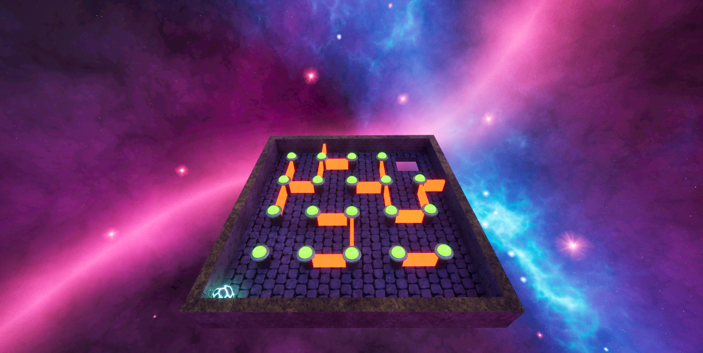
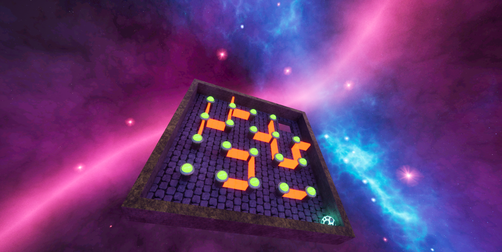
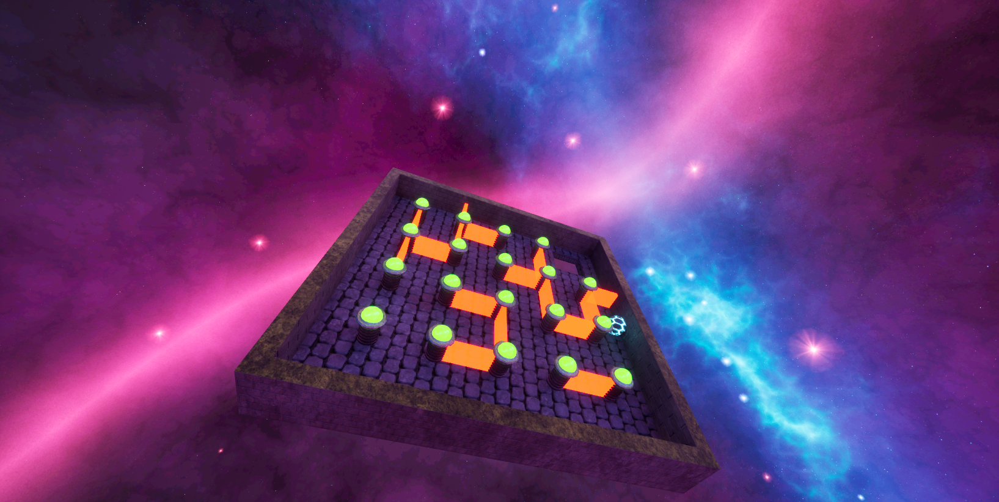

# Marble Run

Simple Marble Maze Navigation Game built in Unreal Engine.

## Project Overview

- **Engine Version:** Unreal Engine 5.6
- **Project Type:** Blueprint Project
- **Target Platform:** Desktop
- **Maps:** MainMenu, Level1
- **Startup Map:** MainMenu

## Rendering & Graphics Settings

- **Graphics API:** DirectX 12
- **Global Illumination:** Lumen (`r.DynamicGlobalIlluminationMethod=1`)
- **Reflections:** Lumen (`r.ReflectionMethod=1`)
- **Shadows:** Virtual Shadow Maps (`r.Shadow.Virtual.Enable=1`)
- **Ray Tracing:** Enabled
- **Auto Exposure:** Extended Default Luminance Range

## Active Plugins

- ModelingToolsEditorMode
- HDRIBackdrop

## In-Game Screenshots

